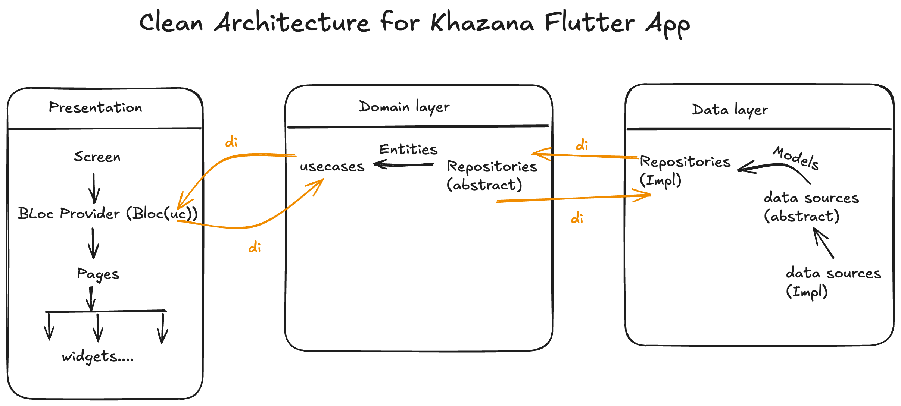

#  Khazana Mutual Funds

A modern Flutter application for mutual fund investment tracking and portfolio management, built with clean architecture principles and cutting-edge technologies.

## ✨ Features

- 📊 **Comprehensive Portfolio Tracking** - Monitor your mutual fund investments in real-time
- 🔐 **Secure Authentication** - Built with Supabase authentication
- 📈 **Data Visualization** - Interactive charts and graphs using FL Charts
- ⭐ **Watchlist Management** - Save and track your favorite funds
- 🌙 **Theme Support** - Consistent Material Design theming
- ⚡ **High Performance** - Optimized data parsing with isolates

## 🏗️ Architecture

This project follows **Clean Architecture** principles, ensuring maintainable, testable, and modular code structure.

<div align="center">
  
</div>

### Architecture Layers:

- **Presentation Layer**: UI components, BLoC state management
- **Domain Layer**: Business logic, entities, and use cases
- **Data Layer**: Repositories, data sources, and models

## 🛠️ Tech Stack

### State Management

- **BLoC/Cubit** - Predictable state management with `flutter_bloc`
- **Hydrated BLoC** - State persistence across app sessions

### Backend & Authentication

- **Supabase** - Backend-as-a-Service with authentication

### Data & Performance

- **Python Scripts** - Mock data generation for testing and development
- **Isolates** - Background processing for parsing large datasets
- **Hive** - Local database for watchlist persistence and caching
- **JSON Processing** - Efficient data parsing and caching mechanisms

### UI & Visualization

- **FL Charts** - Beautiful and interactive data visualization
- **Material Design 3** - Consistent theming with `flex_color_scheme`
- **Custom Fonts** - Gilroy font family for elegant typography
- **SVG Support** - Scalable vector graphics with `flutter_svg`

### Architecture & DI

- **GetIt** - Service locator for dependency injection
- **Clean Architecture** - Separation of concerns and testability
- **Repository Pattern** - Abstracted data access layer

## 🎥 Video Walkthrough

## 📥 Download & Test

### 🤖 Android APK

Want to test the app? Download the latest release APK:

<div align="center">
  <a href="releases/khazana-v1.0.0-release.apk">
    
  </a>
</div>

**📋 Release Information:**

- **Version**: 1.0.0
- **Build**: Release
- **Size**: ~26.2 MB
- **Minimum Android**: API Level 21 (Android 5.0)
- **Target Android**: API Level 34 (Android 14)

**⚠️ Installation Notes:**

- Enable "Install from Unknown Sources" in your Android settings
- This is a test build signed with debug keys
- For production use, proper release signing will be implemented

### 🔨 Build Your Own APK

You can also build the APK yourself:

```bash
# Clean the project
flutter clean

# Get dependencies
flutter pub get

# Build release APK
flutter build apk --release

# APK will be available at: build/app/outputs/flutter-apk/app-release.apk
```

## 🚀 Getting Started

### Prerequisites

- Flutter SDK (^3.29)
- Dart SDK
- Android Studio / VS Code
- Supabase account (for authentication)

### Installation

1. **Clone the repository**

   ```bash
   git clone https://github.com/Umair-Syed/Khazana-Mutual-Funds.git
   cd khazana_mutual_funds
   ```

2. **Install dependencies**

   ```bash
   flutter pub get
   ```

3. **Generate mock data** (Optional)

   ```bash
   cd scripts
   python generate_fund_data.py
   ```

4. **Set up environment variables**

   ```bash
   # Create .env file in root directory with your Supabase credentials
   SUPABASE_URL=your_supabase_url
   SUPABASE_ANON_KEY=your_supabase_anon_key
   ```

5. **Run the app**
   ```bash
   flutter run
   ```

## 📊 Performance Optimizations

- **Isolate Processing**: Large JSON datasets are parsed in background isolates to prevent UI blocking
- **Data Caching**: Intelligent caching system reduces API calls and improves load times
- **Lazy Loading**: Efficient data loading strategies for better user experience
- **Optimized Builds**: Production builds optimized for size and performance

## 🔧 Development

### Code Generation

```bash
# Generate necessary files (for Hive, JSON serialization, etc.)
flutter packages pub run build_runner build
```

### Testing

```bash
# Run tests
flutter test
```

## 📂 Project Structure

```
lib/
├── core/                 # Core utilities, constants, and configurations
├── data/                 # Data layer (repositories, data sources, models)
├── domain/               # Domain layer (entities, use cases, repositories)
├── presentation/         # Presentation layer (pages, widgets, BLoC)
└── injection_container.dart # Dependency injection setup

assets/
├── data/                 # JSON data files
├── images/               # App images and illustrations
├── fonts/                # Custom fonts
└── logo.svg             # App logo

scripts/
└── generate_fund_data.py # Python script for mock data generation
```

## 📞 Contact

- **Developer**: Umair
- **Email**: syedumairandrabi66@gmail.com
- **Project Link**: [https://github.com/Umair-Syed/Khazana-Mutual-Funds](https://github.com/Umair-Syed/Khazana-Mutual-Funds)

---

<div align="center">
  Made with ❤️ using Flutter
</div>
